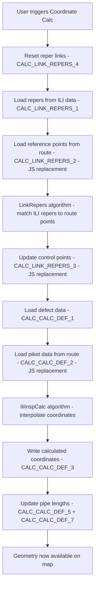

# ILI Coordinate Calculation Migration Plan

## Background

After importing ILI XML data, defect records (`sgio_ili_data`) have `x_coord` and `y_coord` set to 0 (or NULL) because the ILI vendor XML files typically contain only odometer distances, not GPS coordinates. The server has a separate **coordinate calculation pipeline** that maps odometer distances to geographic coordinates along the pipeline route. This pipeline needs to be migrated to the desktop app.

## Architecture Overview

The coordinate calculation consists of two main services that run sequentially:



### Key Challenge: PostGIS → Spatialite/JavaScript

Three SQL queries use heavy PostGIS spatial functions that do NOT exist in Spatialite:

| Query | PostGIS Functions Used | Migration Strategy |
|-------|----------------------|-------------------|
| `CALC_CALC_DEF_2` | `ST_DumpPoints`, `ST_LineMerge`, `ST_InterpolatePoint`, `ST_LineInterpolatePoint`, `ST_LineLocatePoint`, `ST_within`, `st_buffer`, `string_agg` | **Rewrite in JavaScript** using route geometry from DB |
| `CALC_LINK_REPERS_2` | Same PostGIS functions | **Rewrite in JavaScript** |
| `CALC_LINK_REPERS_3` | Same PostGIS functions + UPDATE with subquery | **Rewrite in JavaScript** — split into JS calc + simple SQL UPDATE |

The remaining queries (`CALC_CALC_DEF_1`, `CALC_CALC_DEF_3`, `CALC_CALC_DEF_5`, `CALC_CALC_DEF_7`, `CALC_LINK_REPERS_1`, `CALC_LINK_REPERS_4`) are simple SELECT/UPDATE statements that work in Spatialite as-is (already present in `UTE_SEM.xml`).

Queries `CALC_CALC_DEF_6`, `CALC_CALC_DEF_8`, `CALC_CALC_DEF_10`, `CALC_CALC_DEF_11`, `CALC_CALC_DEF_12`, `CALC_CALC_DEF_13` are all **no-ops** in the server (`select null res`) and can be skipped entirely.

---

## Phase 7.1: SQL Queries — Add Missing + Spatialite Adaptations

**File:** `src/assets/resources/Project/SqlQueries/UTE_SEM.xml`

### Queries already present (no changes needed):
- `CALC_CALC_DEF_1` — SELECT defects for calculation
- `CALC_CALC_DEF_3` — UPDATE defect coordinates
- `CALC_CALC_DEF_5` — SELECT pipe length data
- `CALC_CALC_DEF_7` — UPDATE pipe length coordinates
- `CALC_LINK_REPERS_1` — SELECT repers from ILI data
- `CALC_LINK_REPERS_4` — Reset reper links
- `ILI_ILI_INSP_PROC_C_1` — Get route_id by inspection

### New queries to add:

#### `CALC_ROUTE_GEOMETRY` — Load route geometry for JS processing
```sql
SELECT id, AsText(Geometry) as geom FROM pods_route WHERE id = {P_ROUTE_ID}
```

#### `CALC_MARKERS_NEAR_ROUTE` — Load markers near route for reper matching
```sql
SELECT station_id, station, AsText(Geometry) as geom FROM pods_marker
```

#### `CALC_VALVES_NEAR_ROUTE` — Load valves near route for reper matching
```sql
SELECT id, AsText(Geometry) as geom FROM pods_valve
```

#### `CALC_ILI_FIXED_REPERS` — Load manually fixed repers
```sql
SELECT ili_data_id, calibrated_measure, x_coord, y_coord, station, ref_event_id
FROM sgio_ili_data
WHERE ili_inspection_id = {P_REPORT_ID} AND ref_event_id = -999 AND calibrated_measure IS NOT NULL
```

#### `CALC_UPDATE_CONTROL_POINT` — Update a single control point after reper linking
```sql
UPDATE sgio_ili_data
SET ref_event_id = {FACILITY_ID}, control_point_lf = 'Y',
    calibrated_measure = {MEASURE}, certainty_interval = {COEFF}
WHERE ili_data_id = {REPER_ID} AND COALESCE(ref_event_id, 0) != -999
```

### Queries that are no-ops (skip in code):
- `CALC_CALC_DEF_6` — commented out in server
- `CALC_CALC_DEF_8` — no-op
- `CALC_CALC_DEF_10` — no-op
- `CALC_CALC_DEF_11` — no-op
- `CALC_CALC_DEF_12` — no-op
- `CALC_CALC_DEF_13` — no-op

---

## Phase 7.2: Port LinkRepers Algorithm

**Source:** `server/baseserver_ute-master/src/service/ute/ili/ili-insp-link/LinkRepers.js`
**Target:** `electron/iliCalc/linkRepers.js`

This is a pure algorithmic module — no DB access, no PostGIS. It takes two data tables (REP and GP) and correlates repers from the ILI report with geographic reference points from the route.

### Algorithm summary:
1. `fillDict_()` — Convert tables to Maps of `ReperInfo` objects
2. `fillDists_()` — Calculate distances between all repers of type '1' (valves)
3. `fillDistrib_()` — Correlate ILI repers with route reference points using Gaussian distance matching
4. `normalizeD_()` — Normalize correlation scores
5. `keepBest_()` — Keep only the best matches, remove duplicates
6. `calcCoeff_()` — Calculate quality coefficients and build result table

### Migration notes:
- Uses `decimal.js` for high-precision arithmetic — need to add as dependency
- Pure computation, no I/O — straightforward port
- Input: `{ Tables: { REP: {rows: [...]}, GP: {rows: [...]} } }`
- Output: `{ rows: [{REPER_ID, FACILITY_ID, COEFF}, ...] }`

---

## Phase 7.3: Port IliInspCalc Algorithm

**Source:** `server/baseserver_ute-master/src/service/ute/ili/ili-insp-calc/IliInspCalc.js`
**Target:** `electron/iliCalc/iliInspCalc.js`

This is also a pure algorithmic module. It takes defect data (with odometer distances) and piket data (route reference points with coordinates) and interpolates geographic coordinates for each defect.

### Algorithm summary:
1. Filter control points (repers) from data
2. Calculate average error coefficient (`avgDd`)
3. `processRange()` — For each range between control points, linearly interpolate `MEASURE` and `ACCURACY` for all defects in that range
4. `interpolate()` — For each defect, find the two nearest pikets and linearly interpolate X, Y, Z, DEPTH, STATION coordinates

### Migration notes:
- Uses `decimal.js` for high-precision arithmetic
- Pure computation, no I/O
- Input: `{ Tables: { DATA: {rows: [...]}, PIKET: {rows: [...]} } }`
- Output: `{ rows: [{ILI_DATA_ID, X, Y, Z, DEPTH, STATION, MEASURE, ...}, ...] }`

---

## Phase 7.4: Route Geometry Processing (NEW — replaces PostGIS queries)

**Target:** `electron/iliCalc/routeGeometry.js`

This is the **new module** that replaces the PostGIS spatial queries (`CALC_CALC_DEF_2`, `CALC_LINK_REPERS_2`). It processes the route geometry in JavaScript.

### What the PostGIS queries do:
1. Load route geometry from `pods_route`
2. Decompose the linestring into individual segments
3. Calculate cumulative distances along the route
4. Create a measured linestring (with M values = cumulative distance)
5. For each marker/valve near the route:
   - Project it onto the route line
   - Calculate its measure (distance along route)
   - Get its interpolated coordinates on the route
6. Return a table of reference points with: `MEASURE, STATION, X, Y, Z, STATION_ID, ...`

### JavaScript implementation plan:

```javascript
// routeGeometry.js

/**
 * Process route geometry and build piket table for coordinate interpolation.
 * Replaces PostGIS queries CALC_CALC_DEF_2 and CALC_LINK_REPERS_2.
 */

// 1. Parse route WKT geometry into array of [x, y] coordinate pairs
// 2. Calculate cumulative distances between consecutive points (Haversine or Vincenty)
// 3. For each marker/valve:
//    a. Find nearest point on route (point-to-line projection)
//    b. Calculate measure (cumulative distance to projection point)
//    c. Get interpolated X, Y at projection point
// 4. Also include manually fixed repers from sgio_ili_data (ref_event_id = -999)
// 5. Sort all reference points by measure
// 6. Return as piket table format expected by IliInspCalc
```

### Key geometric functions to implement:
- `parseWKT(wkt)` — Parse MULTILINESTRING/LINESTRING WKT to coordinate arrays
- `haversineDistance(lat1, lon1, lat2, lon2)` — Distance between two points
- `cumulativeDistances(coords)` — Build cumulative distance array along route
- `projectPointOnLine(point, lineCoords, cumDists)` — Find nearest point on line, return measure and projected coords
- `interpolateOnLine(measure, lineCoords, cumDists)` — Get X, Y at a given measure along the line

### Data sources:
- Route geometry: `SELECT AsText(Geometry) as geom FROM pods_route WHERE id = {P_ROUTE_ID}`
- Markers: `SELECT station_id, station, AsText(Geometry) as geom FROM pods_marker`
- Valves: `SELECT id, AsText(Geometry) as geom FROM pods_valve`
- Fixed repers: `SELECT ... FROM sgio_ili_data WHERE ref_event_id = -999`

---

## Phase 7.5: Create Orchestrator Services

### `electron/iliCalc/linkRepersService.js`

Orchestrates the reper linking process:

```
1. Reset reper links (CALC_LINK_REPERS_4)
2. Get route_id (ILI_ILI_INSP_PROC_C_1)
3. Load ILI repers (CALC_LINK_REPERS_1)
4. Load route geometry + markers + valves (new JS queries)
5. Build GP table using routeGeometry.js (replaces CALC_LINK_REPERS_2)
6. Run LinkRepers.process(ds) algorithm
7. For each result row, update control point (replaces CALC_LINK_REPERS_3)
```

### `electron/iliCalc/iliInspCalcService.js`

Orchestrates the coordinate calculation:

```
1. Load defect data (CALC_CALC_DEF_1)
2. Load route geometry + markers + valves (new JS queries)
3. Build PIKET table using routeGeometry.js (replaces CALC_CALC_DEF_2)
4. Run IliInspCalc.process(ds) algorithm
5. Write calculated coordinates (CALC_CALC_DEF_3 via dbWriter)
6. Load pipe lengths (CALC_CALC_DEF_5)
7. Update pipe length coordinates (CALC_CALC_DEF_7 via dbWriter)
```

### `electron/iliCalc/coordinateCalcService.js`

Top-level orchestrator that combines both:

```
1. LinkRepersService.process() — link repers
2. IliInspCalcService.process() — calculate coordinates
3. Report progress throughout
```

---

## Phase 7.6: IPC Handler

**File:** `electron/ipc/iliCalcHandlers.js`

```javascript
ipcMain.handle('ili-calc-coordinates', async (event, { dbPath, inspectionId }) => {
    // 1. Open DB
    // 2. Run coordinateCalcService
    // 3. Report progress via event.sender.send()
    // 4. Return result
});
```

**File:** `electron/preload.js` — Add:
```javascript
iliCalcCoordinates: (params) => ipcRenderer.invoke('ili-calc-coordinates', params),
onIliCalcProgress: (callback) => ipcRenderer.on('ili-calc-progress', (_, data) => callback(data)),
```

---

## Phase 7.7: Add decimal.js Dependency

```bash
npm install decimal.js
```

Both `LinkRepers.js` and `IliInspCalc.js` use `decimal.js` for high-precision arithmetic to avoid floating-point errors in coordinate calculations.

---

## Phase 7.8: UI — Coordinate Calculation Trigger

Two options for triggering the calculation:

### Option A: Button in the import completion dialog
After import completes, show a "Рассчитать координаты" button that triggers the calculation.

### Option B: Separate menu item
Add "Расчёт координат ВТД" to the app menu dropdown, which opens a dialog to select an inspection report and run the calculation.

### Option C: Auto-calculate after import (recommended)
Add a checkbox "Рассчитать координаты после импорта" in the import dialog. If checked, automatically run the coordinate calculation after import completes.

**Recommended: Option C** — matches the server behavior where `do_calc_inspection` flag controls auto-calculation.

### UI Components needed:
- Checkbox in `ILIImportDialog.jsx` for auto-calc
- Progress reporting during calculation (reuse existing progress modal)
- Success/error notification after calculation

---

## Phase 7.9: Integration with Import Flow

Modify `electron/iliImport/iliImportService.js` to optionally run coordinate calculation after import:

```javascript
// After Step 12 (COMMIT):
if (params.doCalcInspection) {
    progress(13, 'Привязка реперов...', 0);
    await linkRepersService.process(db, { P_REPORT_ID: inspectionId, P_ROUTE_ID: routeId }, sqlQueriesDir, onProgress);
    
    progress(14, 'Расчёт координат...', 50);
    await iliInspCalcService.process(db, { P_REPORT_ID: inspectionId, P_ROUTE_ID: routeId }, sqlQueriesDir, onProgress);
}
```

---

## Phase 7.10: Testing

1. Import an ILI XML file
2. Verify `x_coord`/`y_coord` are 0 after import
3. Run coordinate calculation
4. Verify `x_coord`/`y_coord` have real values
5. Reload the ВТД.Дефекты layer
6. Verify points appear on the map along the pipeline route
7. Verify "Show on map" button works from FeatureTable

---

## File Structure

```
electron/
  iliCalc/
    linkRepers.js          — LinkRepers algorithm (from server)
    iliInspCalc.js         — IliInspCalc algorithm (from server)
    routeGeometry.js       — Route geometry processing (NEW, replaces PostGIS)
    linkRepersService.js   — LinkRepers orchestrator
    iliInspCalcService.js  — IliInspCalc orchestrator
    coordinateCalcService.js — Top-level orchestrator
  ipc/
    iliCalcHandlers.js     — IPC handlers for coordinate calculation
```

---

## Dependencies

| Package | Purpose | Status |
|---------|---------|--------|
| `decimal.js` | High-precision arithmetic for coordinate interpolation | **Need to install** |
| `fast-xml-parser` | XML parsing (already installed) | ✅ |
| `iconv-lite` | Encoding conversion (already installed) | ✅ |

---

## Risk Assessment

| Risk | Impact | Mitigation |
|------|--------|------------|
| Spatialite geometry functions differ from PostGIS | High | Implement geometry processing in JS instead of SQL |
| `decimal.js` precision differences | Low | Same library used on server |
| Route geometry in different CRS (3857 vs 4326) | Medium | Transform coordinates in JS before processing |
| Large datasets causing slow calculation | Medium | Add progress reporting, batch processing |
| Missing markers/valves in local DB | Medium | Handle gracefully — skip reper linking if no reference points |
