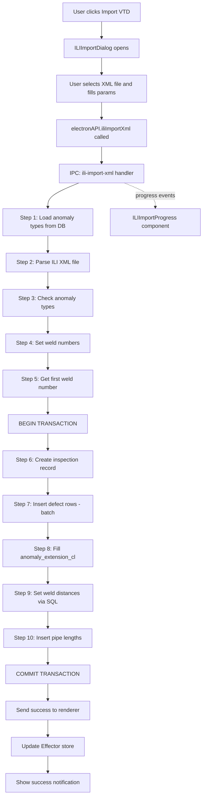
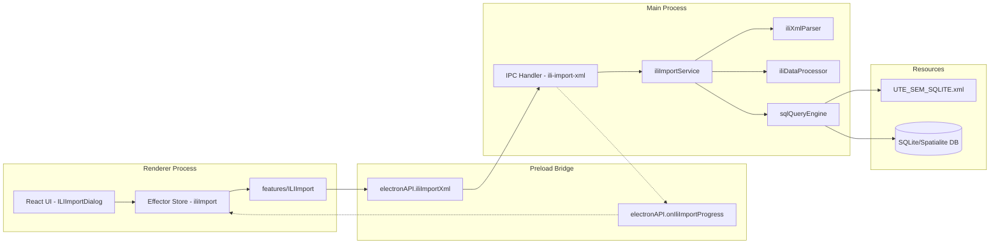

# Plan: Migrate ili-import-xml from Server to Electron+React App

## Overview

Migrate the ILI XML report import functionality from the Express.js server application (`server/baseserver_ute-master/`) into the existing Electron + React desktop application. The server uses PostgreSQL via Sequelize + `gis-core`; the desktop app uses **SQLite/Spatialite** via the `spatialite` npm package. SQL commands are defined in `server/UTE_SEM.xml` and must be read from that file at runtime.

---

## Architecture Comparison

### Server (source)
- **DB**: PostgreSQL via Sequelize (`gis-core` wrapper)
- **SQL source**: XML files (e.g. `UTE_SEM.xml`) parsed with `camaro` library, queries identified by `FILE#ID` pattern
- **Query param substitution**: `{PARAM_NAME}` placeholders replaced by `prepareService.generateQuery()`
- **XML report parsing**: `camaro` library transforms ILI XML (IPL_INSPECT format) into JSON
- **Encoding**: `iconv` CLI for cp1251→utf8 conversion
- **Geo processing**: `gdal` (node-gdal) for spatial point-in-polygon checks (`BufProcessor`)
- **Transport**: Express HTTP POST endpoint `/api/ute/ili-import-xml`

### Desktop (target)
- **DB**: SQLite/Spatialite via `spatialite` npm package
- **IPC bridge**: Electron IPC (`ipcMain.handle` / `ipcRenderer.invoke`) exposed through `preload.js` → `window.electronAPI`
- **Current DB API**: `electronAPI.executeSQL(dbPath, query)` — runs raw SQL, returns `{ rows }`
- **State management**: Effector (stores/events)
- **UI**: React + Ant Design
- **File dialogs**: `electronAPI.openFileDialog()`

---

## Key Differences & Adaptation Notes

| Aspect | Server | Desktop Adaptation |
|--------|--------|--------------------|
| DB engine | PostgreSQL | SQLite/Spatialite — SQL syntax must be adapted |
| `DO $$ ... END $$;` blocks | PostgreSQL PL/pgSQL | **Not supported in SQLite** — must be split into individual statements |
| `camaro` XML parsing | Used for both SQL-XML and ILI-XML | Can reuse for ILI-XML parsing; for SQL-XML use a simpler XML parser since `camaro` requires native compilation |
| `gdal` spatial ops | `BufProcessor` for point-in-polygon | Use Spatialite spatial functions instead |
| `iconv` encoding | CLI subprocess | Use `iconv-lite` npm package (pure JS) |
| Transactions | Sequelize transactions | SQLite `BEGIN/COMMIT/ROLLBACK` via `db.run()` |
| `{PARAM}` substitution | `prepareService.generateQuery()` | Port the `generateQuery()` logic to electron-side utility |

---

## Detailed Step-by-Step Plan

### Phase 1: XML SQL Query Engine (Foundation)

> This is the core infrastructure that enables reading SQL commands from XML files. It must be built first because all subsequent DB operations depend on it.

#### Step 1.1: Copy UTE_SEM.xml into the app resources
- Copy `server/UTE_SEM.xml` to `src/assets/resources/Project/SqlQueries/UTE_SEM.xml`
- This file will be bundled with the app and copied to the user data directory at runtime (similar to how `config.xml` and `VectorLayers/*.xml` are handled)
- Update `electron/resources.js` if needed to ensure the SqlQueries directory is copied

#### Step 1.2: Create XML SQL query parser module
- Create `electron/sqlQueryEngine/xmlQueryParser.js`
- Port the logic from `server/baseserver_ute-master/src/utils/IOUtils.parseXml()` — this reads an XML file like `UTE_SEM.xml`, parses it with an XML parser, and extracts query blocks by ID
- The `camaro` library used on the server requires native compilation which may be problematic in Electron. **Use a pure-JS XML parser instead** (e.g. `fast-xml-parser` or `xml2js`) to parse the `<root><data id="...">` structure
- The parser should accept a `fileRequest` string like `"UTE_SEM.xml#ILI_ILI_ZIP_IMP_C_55_8"` and return the query block with its vars, query text, and type (select/insert/update/delete)

#### Step 1.3: Create query parameter substitution module
- Create `electron/sqlQueryEngine/queryPrepare.js`
- Port the logic from `server/baseserver_ute-master/src/service/sql/prepareService.js` — specifically the `generateQuery()` static method
- This replaces `{PARAM_NAME}` placeholders in SQL with actual values from a params object
- Also port `getValidValue()` for type coercion (Decimal→number, String→string, etc.)
- Port `MathUtils.toNumber()`, `MathUtils.toString()` as utility functions in `electron/sqlQueryEngine/mathUtils.js`

#### Step 1.4: Create SQL execution wrapper with XML support
- Create `electron/sqlQueryEngine/dbExecutor.js`
- Implement functions that mirror the server's `DB` class methods but use the existing Spatialite database:
  - `dbReader(descrId, descrType, params, dbPath)` — parse XML query, substitute params, execute SELECT, return `{columns, rows}`
  - `dbCommand(descrId, descrType, params, dbPath)` — parse XML query, substitute params, execute INSERT/UPDATE, handle output params
  - `dbWriter(descrId, descrType, dataTable, params, dbPath)` — iterate over dataTable rows, execute INSERT for each row
- **Important**: PostgreSQL `DO $$ ... END $$;` blocks must be converted. The XML file's SQL must be adapted for SQLite (see Phase 2)

#### Step 1.5: Register new IPC handlers for XML-based SQL execution
- Add new IPC handlers in `electron/ipc/dbHandlers.js`:
  - `'db-execute-xml'` — accepts `(dbPath, descrId, descrType, params)`, uses the XML query engine to parse, prepare, and execute
  - `'db-execute-xml-batch'` — for batch inserts (like `dbWriter`)
- Expose these in `electron/preload.js`:
  - `executeSQLFromXml: (dbPath, descrId, descrType, params) => ipcRenderer.invoke('db-execute-xml', ...)`
  - `executeSQLFromXmlBatch: (dbPath, descrId, descrType, dataRows, params) => ipcRenderer.invoke('db-execute-xml-batch', ...)`

### Phase 2: Adapt SQL for SQLite/Spatialite

> The SQL in UTE_SEM.xml is written for PostgreSQL. It must be adapted for SQLite.

#### Step 2.1: Adapt ILI_ILI_ZIP_IMP_C_55_9 (load anomaly types)
- Simple SELECT from `sgio_ili_anomaly_type_cl` — should work as-is in SQLite
- Verify the `UPPER()` and string concatenation syntax

#### Step 2.2: Adapt ILI_ILI_ZIP_IMP_C_55_7 (create inspection report)
- Contains `DO $$ ... END $$;` PL/pgSQL block with `RETURNING ... INTO`
- **Split into**: 
  1. A simple `INSERT INTO sgio_ili_inspection(...)` 
  2. A separate `SELECT last_insert_rowid()` to get the new ID
- Replace `TO_DATE('{DATE}','DD.MM.YYYY')` with SQLite date functions

#### Step 2.3: Adapt ILI_ILI_ZIP_IMP_C_55_8 (insert defect rows)
- Contains `DO $$ ... END $$;` PL/pgSQL block
- **Convert to**: plain `INSERT INTO sgio_ili_data(...)` statement
- Replace PostgreSQL-specific functions:
  - `NULLIF(replace(...),...)::numeric` → SQLite `NULLIF(REPLACE(...),'')+0` or `CAST(... AS REAL)`
  - `TO_DATE(...)` → SQLite date string
  - `ROUND(NULLIF(...)::numeric)` → `ROUND(NULLIF(...))`
  - The `CASE WHEN ... THEN 5001 ELSE (SELECT MIN(CODE) FROM ...)` subquery should work but verify

#### Step 2.4: Adapt ILI_ILI_ZIP_IMP_C_55_1 (fill ANOMALY_EXTENSION_CL)
- UPDATE with subquery JOIN — should work in SQLite with minor syntax adjustments

#### Step 2.5: Adapt ILI_ILI_ZIP_IMP_C_55_4 (set weld distances)
- Contains `DO $$ BEGIN ... END $$;` with multiple UPDATE statements
- **Split into** separate UPDATE statements executed sequentially

#### Step 2.6: Adapt ILI_ILI_ZIP_IMP_C_55_5 (prepare pipe lengths)
- INSERT with window functions (`ROW_NUMBER()`, `LEAD()`) — SQLite supports these since 3.25.0
- Should work with minor syntax adjustments

#### Step 2.7: Create SQLite-adapted version of UTE_SEM.xml
- Create `src/assets/resources/Project/SqlQueries/UTE_SEM_SQLITE.xml` with all adapted queries
- OR: add a SQL dialect adapter layer in the query engine that transforms PostgreSQL syntax to SQLite on-the-fly
- **Recommendation**: Create a separate SQLite-adapted XML file for clarity and maintainability

### Phase 3: ILI XML Report Parser

> Port the XML report file parsing logic that reads the ILI inspection data from the vendor XML file.

#### Step 3.1: Create ILI XML parser module
- Create `electron/iliImport/iliXmlParser.js`
- Port `IliImportXmlService.parseSourceFile()` from `server/baseserver_ute-master/src/service/ute/ili/ili-import-xml/IliImportXmlService.js`
- This parses the ILI vendor XML file (IPL_INSPECT format) using `camaro` with XPath templates
- **Alternative to camaro**: Use `fast-xml-parser` or `xml2js` since the XPath templates in camaro are complex. May need to rewrite the extraction logic
- Handle the `recipeTemplate` that extracts defects from `DEFECTS/DEF`, `LINEOBJS/PLOBJ`, `WELDS/WLD`
- Port the post-processing: `hourToDeg()`, `convertNaNToNull()`, type object mapping

#### Step 3.2: Handle encoding conversion
- The server uses `iconv` CLI to convert cp1251→utf8
- **Replace with**: `iconv-lite` npm package (pure JS, no native deps)
- Add `iconv-lite` to `package.json` dependencies
- Create encoding detection/conversion in the parser

#### Step 3.3: Create ILI data processing module
- Create `electron/iliImport/iliDataProcessor.js`
- Port `IliImportXml` class methods from `server/baseserver_ute-master/src/service/ute/ili/ili-import-xml/IliImportXml.js`:
  - `checkTypes()` — validates anomaly type descriptions against the DB dictionary
  - `checkAnomalyTypes()` — wrapper for checkTypes
  - `setWeldNums()` — sorts data by odometer, assigns weld numbers and distances to each defect
  - `getFirstWeldNumber()` — finds the first weld number in the dataset
- **Remove** `setSrvDistrictId()` — this uses `gdal` + `BufProcessor` for spatial point-in-polygon. Either:
  - Skip this step initially (set SRV_DISTRICT_GCL = 0 for all)
  - OR implement using Spatialite spatial queries instead of gdal

### Phase 4: Main Import Service (Electron side)

> Orchestrate the full import pipeline in the Electron main process.

#### Step 4.1: Create the main import orchestrator
- Create `electron/iliImport/iliImportService.js`
- Port the pipeline from `IliImportXmlService.call()`:

```
Pipeline steps:
1. load_types        → SELECT anomaly types from DB (UTE_SEM.xml#ILI_ILI_ZIP_IMP_C_55_9)
2. sub_template      → Parse the ILI XML file (iliXmlParser)
3. check_anomaly_types → Validate types (iliDataProcessor.checkAnomalyTypes)
4. set_weld_nums     → Process weld numbers (iliDataProcessor.setWeldNums)
5. get_first_weld_number → Get first weld (iliDataProcessor.getFirstWeldNumber)
6. BEGIN TRANSACTION
7. create_report     → INSERT inspection record (UTE_SEM.xml#ILI_ILI_ZIP_IMP_C_55_7)
8. load_ili_data     → INSERT all defect rows (UTE_SEM.xml#ILI_ILI_ZIP_IMP_C_55_8)
9. prepare_data      → UPDATE anomaly_extension_cl (UTE_SEM.xml#ILI_ILI_ZIP_IMP_C_55_1)
10. set_weld_nums_old → UPDATE weld distances (UTE_SEM.xml#ILI_ILI_ZIP_IMP_C_55_4)
11. prepare_pipe_len  → INSERT pipe lengths (UTE_SEM.xml#ILI_ILI_ZIP_IMP_C_55_5)
12. COMMIT TRANSACTION
```

- **Skip for now** (Phase 2 / future work):
  - `set_srv_district_id` (requires spatial processing)
  - `calc_report` (ili-insp-link, ili-insp-calc — complex calculation services)
  - `ili-cluster`, `ili-pressure`, `sto-ili-insp-proc`, `sto-ehz-insp-proc`

#### Step 4.2: Register IPC handler for the import
- Add to `electron/ipc/dbHandlers.js` (or create new `electron/ipc/iliImportHandlers.js`):
  - `'ili-import-xml'` — accepts `(dbPath, xmlFilePath, params)`, runs the full import pipeline
  - Should emit progress events back to renderer via `event.sender.send('ili-import-progress', { step, percent, message })`
- Register in `electron/main.js`
- Expose in `electron/preload.js`:
  - `iliImportXml: (dbPath, xmlFilePath, params) => ipcRenderer.invoke('ili-import-xml', ...)`
  - `onIliImportProgress: (callback) => ipcRenderer.on('ili-import-progress', callback)`

#### Step 4.3: Add transaction support to DB handlers
- The current `db-execute` handler doesn't support transactions
- Add `db.run('BEGIN TRANSACTION')` / `db.run('COMMIT')` / `db.run('ROLLBACK')` support
- Option A: Execute BEGIN/COMMIT as regular SQL statements through existing handler
- Option B: Add dedicated `'db-begin-transaction'`, `'db-commit'`, `'db-rollback'` IPC handlers
- **Recommendation**: Option A is simpler and sufficient for SQLite (single-writer model)

### Phase 5: React UI Components

> Build the user interface for triggering and monitoring the ILI XML import.

#### Step 5.1: Create import parameters form component
- Create `src/components/ILIImport/ILIImportDialog.jsx`
- Form fields (based on `validationService.js` params):
  - File picker for XML file (using `electronAPI.openFileDialog()`)
  - Route/pipe selector (dropdown from DB)
  - KM start / KM end (number inputs)
  - Date (date picker)
  - Company (text input)
  - Format (text input, default "xml")
- Use Ant Design `Modal` + `Form` components
- Validate required fields before submission

#### Step 5.2: Create import progress component
- Create `src/components/ILIImport/ILIImportProgress.jsx`
- Reuse the pattern from existing `KMLImportProgress.jsx`
- Show step-by-step progress with status messages:
  - "Загрузка справочника аномалий..."
  - "Чтение XML файла..."
  - "Проверка типов аномалий..."
  - "Простановка номеров швов..."
  - "Создание записи отчета..."
  - "Вставка дефектов... (X/Y)"
  - "Постобработка данных..."
- Use Ant Design `Modal` + `Progress` + `Steps`

#### Step 5.3: Create Effector store for import state
- Create `src/store/iliImport.js`
- Events: `startImport`, `importProgress`, `importComplete`, `importError`
- Store: `$iliImportState` with fields: `{ isRunning, currentStep, totalSteps, percent, message, error }`

#### Step 5.4: Create import feature module
- Create `src/features/ILIImport/importILIXml.js`
- This is the renderer-side orchestrator that:
  1. Opens file dialog
  2. Validates params
  3. Calls `electronAPI.iliImportXml(dbPath, xmlFilePath, params)`
  4. Listens for progress events
  5. Updates Effector store

#### Step 5.5: Add import trigger to the UI
- Add an "Импорт ВТД" (ILI Import) button/menu item to the appropriate toolbar or menu
- Wire it to open the `ILIImportDialog`

### Phase 6: Testing & Validation

#### Step 6.1: Verify DB schema compatibility
- Ensure the SQLite database has the required tables:
  - `sgio_ili_inspection`
  - `sgio_ili_data`
  - `sgio_ili_pipe_length`
  - `sgio_ili_anomaly_type_cl`
  - `sgio_anomaly_extension_cl`
- Check that column names and types match the SQL in UTE_SEM.xml
- Create migration SQL if tables are missing

#### Step 6.2: Test with sample ILI XML file
- Use a sample ILI XML file in IPL_INSPECT format
- Verify the full pipeline: file selection → parsing → DB insertion → data verification

#### Step 6.3: Verify data integrity
- After import, query the DB to verify:
  - Inspection record created correctly
  - All defects inserted with correct field values
  - Weld numbers and distances calculated correctly
  - Pipe lengths generated correctly

---

## File Structure (New Files)

```
electron/
  iliImport/
    iliImportService.js       # Main import orchestrator (Phase 4.1)
    iliXmlParser.js           # ILI vendor XML parser (Phase 3.1)
    iliDataProcessor.js       # Data processing logic (Phase 3.3)
  sqlQueryEngine/
    xmlQueryParser.js         # XML SQL file parser (Phase 1.2)
    queryPrepare.js           # Query param substitution (Phase 1.3)
    dbExecutor.js             # SQL execution wrapper (Phase 1.4)
    mathUtils.js              # Math utilities (Phase 1.3)
  ipc/
    iliImportHandlers.js      # IPC handlers for import (Phase 4.2)

src/
  assets/resources/Project/
    SqlQueries/
      UTE_SEM_SQLITE.xml      # SQLite-adapted SQL queries (Phase 2.7)
  components/
    ILIImport/
      ILIImportDialog.jsx     # Import params form (Phase 5.1)
      ILIImportProgress.jsx   # Progress display (Phase 5.2)
  features/
    ILIImport/
      importILIXml.js         # Renderer-side orchestrator (Phase 5.4)
  store/
    iliImport.js              # Effector store (Phase 5.3)
```

---

## Dependencies to Add

| Package | Purpose | Phase |
|---------|---------|-------|
| `iconv-lite` | cp1251→utf8 encoding conversion (pure JS replacement for `iconv` CLI) | 3.2 |
| `fast-xml-parser` | Parse UTE_SEM.xml and ILI XML files (pure JS, no native deps) | 1.2, 3.1 |

---

## What is NOT being migrated (out of scope)

These server features are complex calculation services that depend on additional infrastructure. They should be migrated in future phases:

1. **ili-insp-link** (LinkRepersService) — Reper linking with spatial queries
2. **ili-insp-calc** (IliInspCalcService) — Defect coordinate calculation
3. **ili-cluster** (IliClusterService) — Defect clustering
4. **ili-pressure** (IliPressureService) — Pressure calculations per STO standards
5. **sto-ili-insp-proc** (StoIliInspService) — Linear indicators per STO
6. **sto-ehz-insp-proc** (StoEnzInspService) — EHZ inspection processing
7. **setSrvDistrictId** — LPU district assignment (requires spatial point-in-polygon)

---

## Execution Order Summary

```
Phase 1: XML SQL Query Engine ← FOUNDATION, do first
  1.1 Copy UTE_SEM.xml to resources
  1.2 XML SQL query parser
  1.3 Query parameter substitution
  1.4 SQL execution wrapper
  1.5 IPC handlers for XML-based SQL

Phase 2: SQL Adaptation ← Parallel with Phase 1
  2.1-2.6 Adapt each query for SQLite
  2.7 Create UTE_SEM_SQLITE.xml

Phase 3: ILI XML Parser ← After Phase 1
  3.1 ILI XML parser module
  3.2 Encoding conversion
  3.3 Data processing module

Phase 4: Import Service ← After Phases 1-3
  4.1 Main orchestrator
  4.2 IPC handler
  4.3 Transaction support

Phase 5: React UI ← After Phase 4
  5.1 Import dialog
  5.2 Progress component
  5.3 Effector store
  5.4 Feature module
  5.5 UI trigger

Phase 6: Testing ← After Phase 5
  6.1 DB schema check
  6.2 End-to-end test
  6.3 Data integrity verification
```

---

## Mermaid: Import Pipeline Flow



## Mermaid: Architecture Layers


