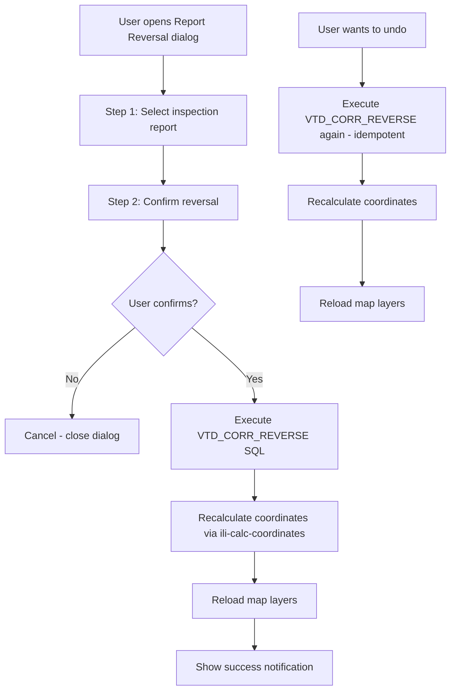
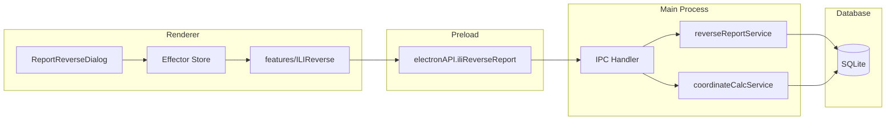

# Plan: ILI Report Reversal (Разворот отчета ВТД)

## Background

When an ILI (In-Line Inspection) pig traverses a pipeline, it records defect positions using an odometer. Sometimes the pig travels in the opposite direction to the pipeline's reference direction (station numbering). In this case, the odometer values need to be "reversed" — inverted relative to the maximum odometer value — so that defect positions align correctly with the pipeline's reference coordinate system.

This feature exists on the Gazprom server as `GAZPROM_ADM_SEM.xml#VTD_CORR_REVERSE` and needs to be migrated to the desktop Electron app.

## Source Analysis

### VTD_CORR_REVERSE SQL (from GAZPROM_ADM_SEM.xml)

The original PostgreSQL query performs two UPDATE operations:

**Step 1 — Reverse `sgio_ili_data` odometers:**
```sql
UPDATE sgio.ILI_data SET
  absolute_odometer = ABS(absolute_odometer - (SELECT MAX(absolute_odometer) FROM sgio.ILI_data WHERE ili_inspection_id = {ID})),
  us_weld_odometer  = ABS(us_weld_odometer  - (SELECT MAX(absolute_odometer) FROM sgio.ILI_data WHERE ili_inspection_id = {ID})),
  ds_weld_odometer  = ABS(ds_weld_odometer  - (SELECT MAX(absolute_odometer) FROM sgio.ILI_data WHERE ili_inspection_id = {ID}))
WHERE ili_inspection_id = {ID};
```

**Step 2 — Reverse `sgio_ili_pipe_length` odometers + swap coordinates:**
```sql
UPDATE sgio.ILI_pipe_length SET
  start_odometer = ABS(start_odometer - (SELECT MAX(absolute_odometer) FROM sgio.ILI_data WHERE ili_inspection_id = {ID})),
  end_odometer   = ABS(end_odometer   - (SELECT MAX(absolute_odometer) FROM sgio.ILI_data WHERE ili_inspection_id = {ID})),
  x_coord_start = x_coord_end,
  y_coord_start = y_coord_end,
  x_coord_end   = x_coord_start,
  y_coord_end   = y_coord_start
WHERE ili_inspection_id = {ID};
```

### Key Observations
- The reversal formula is: `new_value = ABS(old_value - max_odometer)`
- This is an **idempotent** operation — applying it twice returns to the original state (since `ABS(ABS(x - max) - max) = x` when all values are between 0 and max)
- Pipe length coordinates are swapped (start ↔ end) because the direction reverses
- After reversal, coordinates become invalid and must be recalculated via the existing `ili-calc-coordinates` pipeline

### Related Queries (also from GAZPROM_ADM_SEM.xml)
- `VTD_CORR_LINK` — Manually link a reper to a map point (sets `ref_event_id = -999`)
- `VTD_CORR_UNLINK` — Unlink a reper from a map point (resets `calibrated_measure`, `control_point_lf`)

These are NOT part of the reversal feature but are related correction tools that may be implemented later.

---

## Architecture Overview



### Data Flow



---

## Detailed Implementation Plan

### Phase 1: SQL Queries — Add VTD_CORR_REVERSE to UTE_SEM.xml

**File:** `src/assets/resources/Project/SqlQueries/UTE_SEM.xml`

Add two new SQLite-adapted queries:

#### `VTD_CORR_REVERSE_1` — Reverse ILI data odometers
```sql
UPDATE sgio_ili_data SET
  absolute_odometer = ABS(absolute_odometer - (SELECT MAX(absolute_odometer) FROM sgio_ili_data WHERE ili_inspection_id = {ILI_INSPECTION_ID})),
  us_weld_odometer  = ABS(us_weld_odometer  - (SELECT MAX(absolute_odometer) FROM sgio_ili_data WHERE ili_inspection_id = {ILI_INSPECTION_ID})),
  ds_weld_odometer  = ABS(ds_weld_odometer  - (SELECT MAX(absolute_odometer) FROM sgio_ili_data WHERE ili_inspection_id = {ILI_INSPECTION_ID}))
WHERE ili_inspection_id = {ILI_INSPECTION_ID}
```

#### `VTD_CORR_REVERSE_2` — Reverse pipe length odometers + swap coordinates
```sql
UPDATE sgio_ili_pipe_length SET
  start_odometer = ABS(start_odometer - (SELECT MAX(absolute_odometer) FROM sgio_ili_data WHERE ili_inspection_id = {ILI_INSPECTION_ID})),
  end_odometer   = ABS(end_odometer   - (SELECT MAX(absolute_odometer) FROM sgio_ili_data WHERE ili_inspection_id = {ILI_INSPECTION_ID})),
  x_coord_start = x_coord_end,
  y_coord_start = y_coord_end,
  x_coord_end   = x_coord_start,
  y_coord_end   = y_coord_start
WHERE ili_inspection_id = {ILI_INSPECTION_ID}
```

#### `VTD_GET_INSPECTIONS` — Get list of inspections for the dialog dropdown
```sql
SELECT i.ili_inspection_id "ILI_INSPECTION_ID",
  i.description "DESCRIPTION",
  i.comments "COMMENTS",
  i.begin_date "BEGIN_DATE",
  i.tool_vendor_cl "COMPANY",
  i.model "MODEL",
  i.route_id "ROUTE_ID",
  r.description "ROUTE_DESCRIPTION",
  (SELECT COUNT(*) FROM sgio_ili_data d WHERE d.ili_inspection_id = i.ili_inspection_id) "DEFECT_COUNT"
FROM sgio_ili_inspection i
LEFT JOIN pods_route r ON r.id = i.route_id
ORDER BY i.ili_inspection_id DESC
```

**Note:** The PostgreSQL `DO $$ ... END $$;` blocks are NOT needed in SQLite — the queries are split into separate statements and executed sequentially.

---

### Phase 2: Electron Service — Report Reversal Logic

**New file:** `electron/iliCalc/reverseReportService.js`

This service orchestrates the full reversal pipeline:

```
1. Validate that the inspection exists and has data
2. Execute VTD_CORR_REVERSE_1 (reverse sgio_ili_data odometers)
3. Execute VTD_CORR_REVERSE_2 (reverse sgio_ili_pipe_length + swap coords)
4. Run coordinate recalculation (reuse existing runCoordinateCalc)
5. Return success/failure result
```

Key implementation details:
- Use the existing `dbCommand` from `electron/sqlQueryEngine/dbExecutor.js` to execute the SQL
- Wrap steps 2-3 in a transaction for atomicity
- Reuse `runCoordinateCalc` from `electron/iliCalc/coordinateCalcService.js` for step 4
- Report progress via callback for UI updates

---

### Phase 3: IPC Handler

**File:** `electron/ipc/iliCalcHandlers.js` — Add new handler

Add `ili-reverse-report` IPC handler:
```javascript
ipcMain.handle('ili-reverse-report', async (event, dbPath, params) => {
    // params: { inspectionId }
    // 1. Open DB
    // 2. Run reverseReportService
    // 3. Report progress via event.sender.send('ili-reverse-progress', ...)
    // 4. Return result
});
```

**File:** `electron/preload.js` — Add new API methods:
```javascript
iliReverseReport: (dbPath, params) => ipcRenderer.invoke('ili-reverse-report', dbPath, params),
onIliReverseProgress: (callback) => {
    const handler = (_event, data) => callback(data);
    ipcRenderer.on('ili-reverse-progress', handler);
    return () => ipcRenderer.removeListener('ili-reverse-progress', handler);
},
```

---

### Phase 4: Effector Store

**New file:** `src/store/iliReverse.js`

Events and store for managing the reversal dialog and process state:
- `openIliReverseDialog` / `closeIliReverseDialog` — toggle dialog visibility
- `updateIliReverseProgress` — update progress during operation
- `iliReverseComplete` / `iliReverseError` — completion handlers
- `$iliReverseState` — store with fields: `{ dialogOpen, isRunning, currentStep, percent, message, error }`

---

### Phase 5: Feature Module

**New file:** `src/features/ILIReverse/reverseILIReport.js`

Renderer-side orchestrator:
1. Load available inspections via `electronAPI.iliGetInspections(dbPath)` (already exists in preload.js)
2. Call `electronAPI.iliReverseReport(dbPath, { inspectionId })`
3. Listen for progress events via `electronAPI.onIliReverseProgress()`
4. Update Effector store with progress
5. On completion, trigger layer reload (reuse pattern from `src/store/refreshTable.js`)

---

### Phase 6: UI — Dialog Components

#### Step 1 Dialog: Select Inspection

**New file:** `src/components/ILIReverse/ILIReverseDialog.jsx`

A multi-step modal dialog following the same pattern as `ILIImportDialog.jsx`:

**Step 1 — Select inspection report:**
- Dropdown list of available inspections (loaded from DB)
- Each item shows: inspection ID, route description, date, defect count
- "Далее" (Next) button to proceed

**Step 2 — Confirmation:**
- Warning message explaining what the reversal does
- "Данные одометра будут инвертированы. После разворота будет выполнен пересчёт координат."
- "Выполнить" (Execute) and "Отмена" (Cancel) buttons

**Styling:** Reuse the same styled components pattern from `ILIImportDialog.jsx` (CustomHeader, BodyWrapper, StyledModal, etc.)

#### Progress Display

**New file:** `src/components/ILIReverse/ILIReverseProgress.jsx`

Progress modal following the same pattern as `ILIImportProgress.jsx`:
- Shows step-by-step progress:
  - "Разворот данных одометра..."
  - "Разворот длин труб..."
  - "Привязка реперов..."
  - "Расчёт координат..."
  - "Разворот завершён!"

---

### Phase 7: Menu Integration

**File:** `src/App.jsx`

Add new menu item to the dropdown menu:
```javascript
const menuItems = [
    {
        key: 'ili-import',
        label: 'Импорт отчетов XML',
        onClick: openIliImportDialog,
    },
    {
        key: 'ili-reverse',
        label: 'Разворот отчета ВТД',
        onClick: openIliReverseDialog,
    },
    {
        key: 'about',
        label: 'О приложении',
        onClick: openInfoModal,
    },
];
```

Add the dialog and progress components to the render tree:
```jsx
<ILIReverseDialog dbPath={getDbPath()} />
<ILIReverseProgress />
```

---

### Phase 8: Layer Refresh After Reversal

**File:** `src/store/refreshTable.js`

Add watcher for `iliReverseComplete` event to reload ILI layers after reversal:
```javascript
import { iliReverseComplete } from './iliReverse.js';

iliReverseComplete.watch(() => {
    reloadLayersByIds(ILI_LAYER_IDS, layers).then(() => {
        zoomToIliLayer();
    });
});
```

---

## File Structure (New/Modified Files)

```
NEW FILES:
  electron/
    iliCalc/
      reverseReportService.js     — Reversal orchestrator service
  src/
    components/
      ILIReverse/
        ILIReverseDialog.jsx      — Multi-step dialog for report reversal
        ILIReverseProgress.jsx    — Progress display during reversal
    features/
      ILIReverse/
        reverseILIReport.js       — Renderer-side orchestrator
    store/
      iliReverse.js               — Effector store for reversal state

MODIFIED FILES:
  src/assets/resources/Project/SqlQueries/UTE_SEM.xml  — Add VTD_CORR_REVERSE queries
  electron/preload.js                                   — Add iliReverseReport API
  electron/ipc/iliCalcHandlers.js                       — Add ili-reverse-report handler
  src/App.jsx                                           — Add menu item + dialog components
  src/store/refreshTable.js                             — Add layer refresh on reversal complete
```

---

## Execution Order

```
Phase 1: SQL Queries                    ← Foundation
Phase 2: Electron Service               ← Core logic
Phase 3: IPC Handler + Preload          ← Bridge
Phase 4: Effector Store                 ← State management
Phase 5: Feature Module                 ← Renderer orchestrator
Phase 6: UI Dialog Components           ← User interface
Phase 7: Menu Integration              ← Wire everything together
Phase 8: Layer Refresh                  ← Post-operation cleanup
```

---

## Key Design Decisions

1. **Idempotent reversal** — The reversal operation is self-inverse. Applying it twice returns data to the original state. This means "undo" is simply running the same operation again. No need for a separate "restore" mechanism.

2. **Coordinate recalculation is mandatory** — After reversing odometer values, all coordinates become invalid. The existing `runCoordinateCalc` pipeline (reper linking + coordinate interpolation) must run automatically after reversal.

3. **Split SQL into two queries** — SQLite doesn't support `DO $$ ... END $$;` blocks. The original single PostgreSQL block is split into `VTD_CORR_REVERSE_1` and `VTD_CORR_REVERSE_2`, executed sequentially within a transaction.

4. **Reuse existing patterns** — Dialog, progress, store, and IPC patterns follow the established conventions from the ILI Import feature (`ILIImportDialog`, `ILIImportProgress`, `iliImport.js` store).

5. **No separate "restore" button** — Since reversal is idempotent, the same "Разворот отчета" button serves as both "reverse" and "restore". The dialog can show the current state (reversed/not reversed) if needed.

---

## Risk Assessment

| Risk | Impact | Mitigation |
|------|--------|------------|
| NULL odometer values cause ABS to return NULL | Medium | Add COALESCE or WHERE clause to skip NULL values |
| Coordinate recalculation fails after reversal | High | Wrap in transaction; rollback reversal if calc fails |
| User reverses twice accidentally | Low | Idempotent operation — no data loss |
| Large datasets slow down reversal | Low | Simple UPDATE queries; progress reporting |
| Pipe length swap loses data | Low | Swap is symmetric — no data loss |
