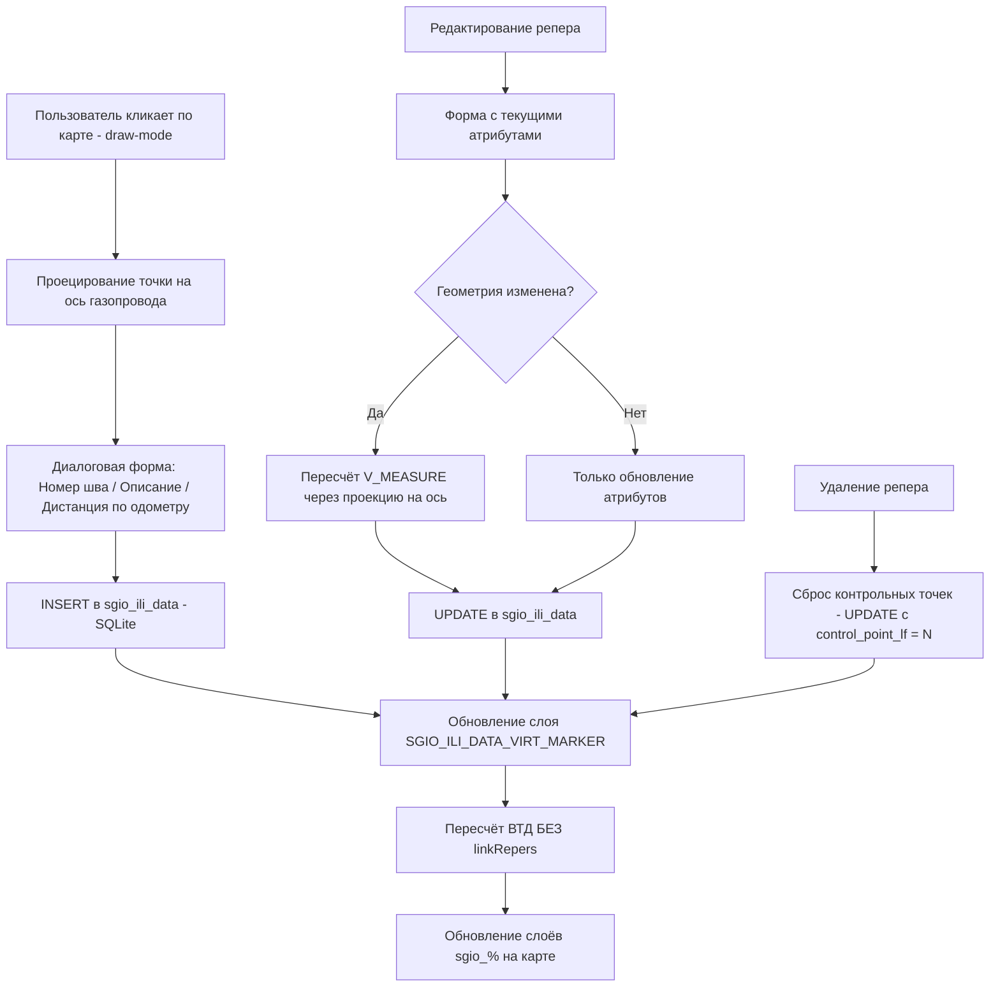
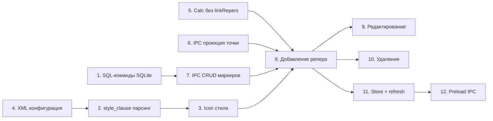

# План реализации: Добавление/редактирование виртуальных реперов

## Обзор

Виртуальный репер — объект, не существующий в реальности, который заносится в таблицу `sgio_ili_data` с кодом репера (`anomaly_type_cl` = 1003/1004) для использования при вычислении геопривязки дефектов наравне с реально зафиксированными реперами.

Слой `SGIO_ILI_DATA_VIRT_MARKER` уже существует в конфигурации. Задача — добавить полноценную поддержку CRUD-операций для виртуальных реперов с пересчётом отчёта ВТД после каждого изменения.

## Архитектура



## Задачи

### 1. Адаптировать SQL-команды из UTE_SEM.xml под SQLite

**Файл:** [`src/assets/resources/Project/SqlQueries/UTE_SEM.xml`](src/assets/resources/Project/SqlQueries/UTE_SEM.xml:475)

Добавить 3 новых SQL-команды с ID `SGIO_VIRT_MARKER#insert`, `SGIO_VIRT_MARKER#update`, `SGIO_VIRT_MARKER#delete`. Адаптировать из существующего блока `PODS_ILI_REPER`, убрав PostgreSQL-конструкции (`DO $$ ... END $$`).

**insert** — перед вставкой удалить близлежащие виртуальные реперы (где `abs(absolute_odometer - {ABSOLUTE_ODOMETER}) < 10` и `abs(calibrated_measure - {V_MEASURE}) < 10` при `feature_description = 'Виртуальный репер'`), затем вставить новую запись в `sgio_ili_data` с:
- `anomaly_type_cl = 1003`
- `feature_description = 'Виртуальный репер'`
- `control_point_lf = 'Y'`
- `ref_event_id = -999`
- `certainty_interval = 0.01`
- Координаты `X_COORD`, `Y_COORD`
- `calibrated_measure` и `pipe_measure` = `V_MEASURE` (геодезическая дистанция)
- `WELD_NUMBER`, `ABSOLUTE_ODOMETER`, `DESCRIPTION`, `ILI_INSPECTION_ID` — из входных параметров

**update** — обновить поля `DESCRIPTION`, `ABSOLUTE_ODOMETER`, `CALIBRATED_MEASURE`, `pipe_measure`, `X_COORD`, `Y_COORD`, `WELD_NUMBER` по `ILI_DATA_ID = {ID}`.

**delete** — НЕ физическое удаление, а сброс полей: `control_point_lf='N'`, `calibrated_measure=null`, `certainty_interval=null` по `ILI_DATA_ID = {ID}`.

### 2. Поддержка `style_clause` в загрузке данных слоя

**Файлы:**
- [`src/legacy/XMLParser.js`](src/legacy/XMLParser.js:279) — парсинг нового XML-тега `<style_clause>`
- [`src/legacy/DBManage.js`](src/legacy/DBManage.js:143) — использование `style_clause` при формировании SELECT-запроса

Сейчас поле `type` для стилизации берётся из колонки `styleTypeColumn` (по умолчанию `type_cl`). Для слоя `SGIO_ILI_DATA_VIRT_MARKER` значение `type` должно вычисляться SQL-выражением из `<style_clause>`:

```sql
d.ANOMALY_TYPE_CL || CASE WHEN d.ref_event_id IS NOT NULL THEN '_LNK' ELSE '_NOTLNK' END
```

Изменения:
- В [`XMLParser.js`](src/legacy/XMLParser.js:279): парсить `<style_clause>` из XML и сохранять в `layer.styleClause`
- В [`DBManage.js`](src/legacy/DBManage.js:163) → [`getDataLayerFromBD()`](src/legacy/DBManage.js:143): если `layer.styleClause` задан, использовать его как SQL-выражение для вычисления `type` вместо простого `layer.styleTypeColumn`:

```sql
SELECT ili_data_id as id, 
  (ANOMALY_TYPE_CL || CASE WHEN ref_event_id IS NOT NULL THEN '_LNK' ELSE '_NOTLNK' END) as type,
  ... 
FROM sgio_ili_data d WHERE anomaly_type_cl IN (1004,1003)
```

Обратить внимание: при наличии `style_clause` запрос должен использовать алиас `d` для таблицы, т.к. выражение ссылается на `d.ANOMALY_TYPE_CL`.

### 3. Стили отображения реперов на карте — иконки по значению `type`

**Файл:** [`src/assets/resources/Project/VectorLayers/SGIO_ILI_DATA_VIRT_MARKER.xml`](src/assets/resources/Project/VectorLayers/SGIO_ILI_DATA_VIRT_MARKER.xml)

Добавить в XML секцию `<styles>` с 4 стилями по значению type:
- `1004_NOTLNK` → `1004_NOTLNK.png`
- `1004_LNK` → `1004_LNK.png`
- `1003_NOTLNK` → `1003_NOTLNK.png`
- `1003_LNK` → `1003_LNK.png`

**Файлы иконок:** Добавить PNG-файлы в `src/assets/resources/images/assets/`:
- `1003_NOTLNK.png` — добавить
- `1004_NOTLNK.png` — добавить
- `1004_LNK.png` — добавить
- `1003_LNK.png` — уже существует

**Файл:** [`src/legacy/XMLParser.js`](src/legacy/XMLParser.js:372) → [`parsePointDekstopStyle()`](src/legacy/XMLParser.js:372)

Сейчас загрузка иконок по `href` закомментирована (Cordova legacy). Нужно реализовать загрузку иконок через Electron:
- Получить базовый путь к ресурсам через `electronAPI.getResourcePath()` (или `window.__resourcePath` если он доступен на старте)
- Создать `ol/style/Icon` с `src` указывающим на локальный файл
- Задать `scale` по параметру `size` из XML

### 4. Обновить XML-конфигурацию слоя SGIO_ILI_DATA_VIRT_MARKER

**Файл:** [`src/assets/resources/Project/VectorLayers/SGIO_ILI_DATA_VIRT_MARKER.xml`](src/assets/resources/Project/VectorLayers/SGIO_ILI_DATA_VIRT_MARKER.xml)

- `<style_clause>` уже есть в новой версии XML — оставить
- Изменить атрибуты для поддержки редактирования: поставить `editable=1` для полей `weld_number`, `absolute_odometer`, `description`  
- Добавить `<show_buttons>` с кнопкой добавления (например `import,export,add`)
- Добавить секцию `<styles>` с 4 стилями на иконки (см. задачу 3)

### 5. Создать функцию пересчёта ВТД без linkRepers

**Файл:** [`electron/iliCalc/coordinateCalcService.js`](electron/iliCalc/coordinateCalcService.js:20)

Добавить экспортируемую функцию `runCoordinateCalcNoLink(db, params, sqlQueriesDir, onProgress)` — аналог [`runCoordinateCalc()`](electron/iliCalc/coordinateCalcService.js:20), но без фазы 1 (вызова `processLinkRepers`). Переиспользовать общую логику: получение `route_id`, проверки, вызов `processIliInspCalc`.

**Файл:** [`electron/ipc/iliCalcHandlers.js`](electron/ipc/iliCalcHandlers.js:12)

Добавить IPC-канал `ili-calc-coordinates-no-link` — вызывает `runCoordinateCalcNoLink`.

### 6. Создать IPC-хэндлер для проецирования точки на ось газопровода

**Файл:** [`electron/ipc/iliCalcHandlers.js`](electron/ipc/iliCalcHandlers.js:12)

Добавить IPC-канал `ili-project-point-on-route`:
- Входные параметры: `dbPath`, `{ x, y }` (координаты в EPSG:4326)
- Шаги:
  1. Получить `ili_inspection_id` из `sgio_ili_inspection` (`SELECT ili_inspection_id FROM sgio_ili_inspection LIMIT 1`)
  2. Получить `route_id` из `sgio_ili_inspection` по найденному `ili_inspection_id`
  3. Загрузить геометрию маршрута из `pods_route` по `route_id`
  4. Спарсить WKT, вызвать [`projectPointOnLine()`](electron/iliCalc/routeGeometry.js:157) из `routeGeometry.js`
  5. Вернуть: `{ measure, projectedLon, projectedLat, routeId, inspectionId }`

### 7. Создать IPC-хэндлеры для CRUD виртуальных реперов

**Новый файл:** `electron/ipc/virtMarkerHandlers.js`

IPC-канал `ili-virt-marker-insert`:
- Входные параметры: `dbPath`, `{ x, y, vMeasure, weldNumber, absoluteOdometer, description }`
- Определить `ili_inspection_id`: `SELECT ili_inspection_id FROM sgio_ili_inspection LIMIT 1`
- Выполнить SQL `SGIO_VIRT_MARKER#insert` через [`dbCommand()`](electron/sqlQueryEngine/dbExecutor.js)
- Вернуть `{ success: true, inspectionId }`

IPC-канал `ili-virt-marker-update`:
- Входные параметры: `dbPath`, `{ id, x, y, vMeasure, weldNumber, absoluteOdometer, description }`
- Выполнить SQL `SGIO_VIRT_MARKER#update` через `dbCommand()`
- Вернуть `{ success: true }`

IPC-канал `ili-virt-marker-delete`:
- Входные параметры: `dbPath`, `{ id }`
- Выполнить SQL `SGIO_VIRT_MARKER#delete` через `dbCommand()`
- Вернуть `{ success: true }`

**Файл:** [`electron/main.js`](electron/main.js) — зарегистрировать `registerVirtMarkerIpc()`

### 8. Специализированная обработка добавления виртуального репера в renderer

**Новый файл:** `src/features/VirtMarker/addVirtMarker.js`

Флоу добавления:
1. Пользователь входит в draw-mode для слоя `SGIO_ILI_DATA_VIRT_MARKER`
2. Кликает по карте → получает координаты точки в EPSG:3857
3. Конвертация в EPSG:4326 через `toLonLat()`
4. Вызов IPC `ili-project-point-on-route` → получает `vMeasure` и спроецированные координаты
5. Показ диалоговой формы с полями:
   - «Номер шва» → `WELD_NUMBER`
   - «Описание» → `DESCRIPTION`
   - «Дистанция по одометру» → `ABSOLUTE_ODOMETER`
   - Спроецированные координаты — передаются автоматически в `{X}`, `{Y}`
6. По нажатию ОК → вызов IPC `ili-virt-marker-insert`
7. При успехе:
   - Обновить слой `SGIO_ILI_DATA_VIRT_MARKER` через [`reloadLayersByIds()`](src/legacy/DBManage.js:303)
   - Запустить IPC `ili-calc-coordinates-no-link` (пересчёт без linkRepers)
   - По завершении пересчёта → обновить все ILI-слои через `reloadLayersByIds(ILI_LAYER_IDS)`

**Файл:** [`src/features/saveFeature/addNewFeature.js`](src/features/saveFeature/addNewFeature.js:6) — добавить ветку:
```js
if (layer.id === 'SGIO_ILI_DATA_VIRT_MARKER') {
    return addVirtMarker(layer, feature);
}
```

### 9. Специализированная обработка редактирования виртуального репера

**Новый файл:** `src/features/VirtMarker/editVirtMarker.js`

При сохранении редактирования для слоя `SGIO_ILI_DATA_VIRT_MARKER`:
1. Если геометрия изменена → пересчитать `V_MEASURE` через IPC `ili-project-point-on-route` с новыми координатами
2. Вызвать IPC `ili-virt-marker-update` с полями: `id`, `x`, `y`, `vMeasure`, `weldNumber`, `absoluteOdometer`, `description`
3. При успехе → тот же цикл обновления:
   - Обновить слой `SGIO_ILI_DATA_VIRT_MARKER`
   - Пересчёт ВТД без linkRepers
   - Обновить все sgio_% слои

**Файл:** [`src/components/InfoAttributeView/hooks/useFeatureActions.js`](src/components/InfoAttributeView/hooks/useFeatureActions.js:61) — расширить [`handleSaveEdit`](src/components/InfoAttributeView/hooks/useFeatureActions.js:61): если слой = `SGIO_ILI_DATA_VIRT_MARKER`, вызвать `editVirtMarker()` вместо стандартного `updateFeatureAttributes()`.

### 10. Специализированная обработка удаления виртуального репера

**Файл:** [`src/features/deleteFeature/deleteFeature.js`](src/features/deleteFeature/deleteFeature.js:5)

Добавить ветку для слоя `SGIO_ILI_DATA_VIRT_MARKER`:
```js
if (layer.id === 'SGIO_ILI_DATA_VIRT_MARKER') {
    // Вызвать IPC ili-virt-marker-delete
    // При успехе → обновить слой + пересчёт + обновить sgio_% слои
    return;
}
```

Вместо физического `DELETE FROM` вызывается IPC `ili-virt-marker-delete`, который сбрасывает `control_point_lf='N'`, `calibrated_measure=null`, `certainty_interval=null`.

### 11. Effector store для пересчёта ВТД после операций с реперами

**Файл:** [`src/store/refreshTable.js`](src/store/refreshTable.js)

Добавить:
- Событие `virtMarkerChanged` (через `createEvent()`)
- Подписку: при `virtMarkerChanged` → обновить `SGIO_ILI_DATA_VIRT_MARKER` + запустить пересчёт через IPC + обновить все ILI-слои

Общая функция `refreshAfterVirtMarkerChange(inspectionId)`:
1. `reloadLayersByIds(['SGIO_ILI_DATA_VIRT_MARKER'], layers)`
2. `electronAPI.invoke('ili-calc-coordinates-no-link', dbPath, { inspectionId })`
3. `reloadLayersByIds(ILI_LAYER_IDS, layers)`

### 12. Регистрация IPC в preload

**Файл:** [`electron/preload.js`](electron/preload.js)

Убедиться, что новые IPC-каналы экспонируются в `electronAPI`:
- `ili-calc-coordinates-no-link`
- `ili-project-point-on-route`
- `ili-virt-marker-insert`
- `ili-virt-marker-update`
- `ili-virt-marker-delete`

---

## Порядок реализации



## Затрагиваемые файлы

| Файл | Действие |
|------|----------|
| `src/assets/resources/Project/SqlQueries/UTE_SEM.xml` | Добавить 3 SQL-команды для SQLite |
| `src/assets/resources/Project/VectorLayers/SGIO_ILI_DATA_VIRT_MARKER.xml` | Обновить: стили, атрибуты, style_clause |
| `src/assets/resources/images/assets/1003_NOTLNK.png` | Добавить иконку |
| `src/assets/resources/images/assets/1004_NOTLNK.png` | Добавить иконку |
| `src/assets/resources/images/assets/1004_LNK.png` | Добавить иконку |
| `src/legacy/XMLParser.js` | Парсинг style_clause + загрузка иконок Icon |
| `src/legacy/DBManage.js` | Поддержка style_clause в SELECT |
| `electron/iliCalc/coordinateCalcService.js` | Функция runCoordinateCalcNoLink |
| `electron/ipc/iliCalcHandlers.js` | IPC: calc-no-link, project-point |
| `electron/ipc/virtMarkerHandlers.js` | Новый: IPC CRUD виртуальных маркеров |
| `electron/main.js` | Регистрация virtMarkerHandlers |
| `electron/preload.js` | Экспозиция новых IPC |
| `src/features/VirtMarker/addVirtMarker.js` | Новый: логика добавления |
| `src/features/VirtMarker/editVirtMarker.js` | Новый: логика редактирования |
| `src/features/saveFeature/addNewFeature.js` | Ветка для SGIO_ILI_DATA_VIRT_MARKER |
| `src/features/deleteFeature/deleteFeature.js` | Ветка для SGIO_ILI_DATA_VIRT_MARKER |
| `src/components/InfoAttributeView/hooks/useFeatureActions.js` | Обработка save для виртуальных реперов |
| `src/store/refreshTable.js` | Событие virtMarkerChanged + подписки |
